# StuffVault

A full-stack **cloud storage application** that allows users to upload and manage their files securely.

The **client** is built with **React**, **Vite**, and **TailwindCSS**, while the **server** uses **Node.js**, **Express**, **MongoDB**, and **Redis**.

The application stores files using **AWS S3** for seamless file transfers.

---

## Table of Contents

- [Features](#features)
  - [Authentication and Security](#authentication-and-security)
  - [File Management](#file-management)
  - [Cloud Storage and Import](#cloud-storage-and-import)
  - [Settings and Customization](#settings-and-customization)
  - [Admin Dashboard](#admin-dashboard)

- [Project Structure](#project-structure)
  - [Client (Frontend - React + Vite + Tailwind)](#client-frontend---react--vite--tailwind)
  - [Server (Backend - Node + Express + MongoDB)](#server-backend---node--express--mongodb)

- [Screenshot Overview](#screenshot-overview)
  - [Login and Register](#login-and-register)
  - [HomePage](#homepage)
  - [Settings](#settings)

- [Tech Stack](#tech-stack)

---

## Features

### Authentication and Security

- User registration and login with email and password.
- OAuth Login for **Google and GitHub**.
- OTP-based verification for secure account setup.
- Passwords stored in hashed format (bcrypt).
- Token stored in cookies (Signed Cookies).
- CORS, Helmet, and sanitization for enhanced security.
- Rate Limiting and Throttling.

### File Management

- Upload any file (PDF, Images, Videos, Docs, etc.) with progress tracking.
- **Cloud storage with AWS S3** for scalable and reliable file storage.
- Supports **Grid and List views** for file navigation.
- View file details (size, type, created date, modified date).
- Rename and delete files.

### Cloud Storage and Import

- **AWS S3 Integration** for secure cloud file storage.
- **CloudFront CDN** for fast file delivery and optimized performance.

### Settings and Customization

- Update profile info.
- Statistic of used/available Storage.
- Change password.
- Manage connected devices/sessions.

### Admin Dashboard

- User Overview - Track total, active, online, and deleted users.
- User Management - View, edit roles, force logout, and delete users.
- Deletion System - Soft Delete (recoverable) and Hard Delete (permanent) with confirmation.
- Role and Permissions - Roles like User, Manager, Admin, Owner with badges.
- Real-Time Tracking - Monitor online users and refresh instantly.

## Project Structure

### Client (Frontend - React + Vite + Tailwind)

```bash
Client/
├── node_modules/
├── public/
│   └── vite.svg
├── src/
│   ├── apis/
│   │   ├── authApi.js
│   │   ├── axiosInstances.js
│   │   ├── directoryApi.js
│   │   ├── fileApi.js
│   │   ├── loginWithGithub.js
│   │   ├── loginWithGoogle.js
│   │   └── userApi.js
│   ├── assets/
│   │   ├── react.svg
│   │   └── ui.png
│   ├── Component/
│   │   ├── Views/
│   │   │   ├── GridView.jsx
│   │   │   └── ListView.jsx
│   │   ├── ActionBar.jsx
│   │   ├── ContextMenu.jsx
│   │   ├── DirectoryItem.jsx
│   │   ├── DirectoryList.jsx
│   │   ├── Header.jsx
│   │   ├── InvalidRoute.jsx
│   │   ├── LandingPage.jsx
│   │   ├── MainView.jsx        # main page after App.jsx
│   │   ├── Settings.jsx
│   │   ├── Sidebar.jsx
│   │   ├── UploadToast.jsx
│   │   └── UsersPage.jsx
│   ├── context/
│   │   └── DirectoryContext.js
│   ├── Forms/
│   │   ├── Login.jsx
│   │   ├── Register.jsx
│   │   └── VerifyOtp.jsx
│   ├── LandingPages/
│   │   ├── Footer.jsx
│   │   ├── HowItWorks.jsx
│   │   ├── LandingSectionCTA.jsx
│   │   ├── LandingSectionOne.jsx
│   │   └── LandingSectionTwo.jsx
│   ├── LegalPages/
│   │   ├── Privacy.jsx
│   │   └── Terms.jsx
│   ├── Models/
│   │   ├── ConfirmActionModal.jsx
│   │   ├── DeleteModel.jsx
│   │   ├── DetailsPopupModel.jsx
│   │   ├── DirectoryModel.jsx
│   │   └── RenameModal.jsx
│   ├── Routes/
│   │   ├── ProtectedRoute.jsx
│   │   ├── PublicRoute.jsx
│   │   └── RoleRoute.jsx
│   ├── Subscription/
│   │   ├── SubscriptionCards.jsx
│   │   ├── SubscriptionPlans.jsx
│   │   └── success.jsx
│   ├── App.jsx
│   ├── AppRoutes.jsx
│   ├── index.css
│   └── main.jsx
├── .env
├── .gitignore
├── eslint.config.js
├── index.html
├── package-lock.json
├── package.json
└── vite.config.js

```

### Server (Backend - Node + Express + MongoDB + AWS)

```bash
server/
├── config/
│   ├── db.js
│   ├── redis.js
│   └── setup.js
├── controllers/
│   ├── authController.js
│   ├── billingController.js
│   ├── directoryController.js
│   ├── fileController.js
│   └── userController.js
├── middlewares/
│   ├── auth.js
│   └── validateIdMiddleware.js
├── models/
│   ├── directoryModel.js
│   ├── fileModel.js
│   ├── otpModel.js
│   ├── sessionModel.js
│   └── userModel.js
├── node_modules/
├── routes/
│   ├── authRoutes.js
│   ├── billingRoutes.js
│   ├── directoryRoutes.js
│   ├── fileRoutes.js
│   └── userRoutes.js
├── services/
│   ├── cloudFront.js
│   ├── googleAuthService.js
│   ├── s3.js
│   └── sendOtpService.js
├── utils/
│   ├── logicalPath.js
│   ├── RateLimiter.js
│   ├── sanitize.js
│   ├── throttler.js
│   └── updateDirectoriesSize.js
├── validators/
│   └── authSchema.js
├── .env
├── .gitignore
├── app.js
├── package-lock.json
└── package.json

```

## Screenshot Overview

### Login and Register

<p align="center">
  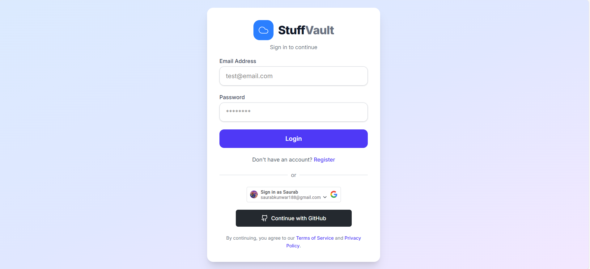
  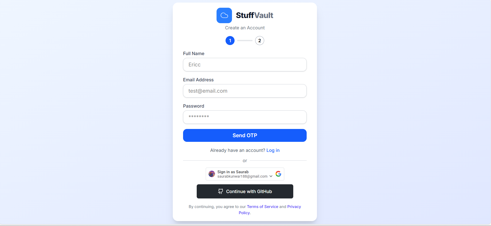
  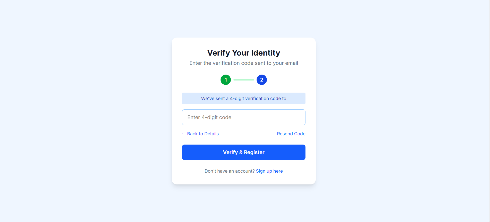
</p>

---

### HomePage

<p align="center">
  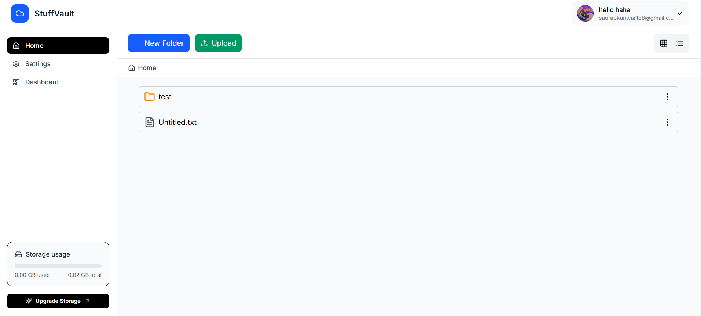
  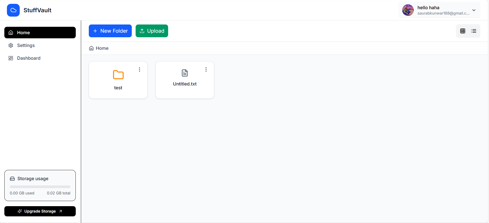
  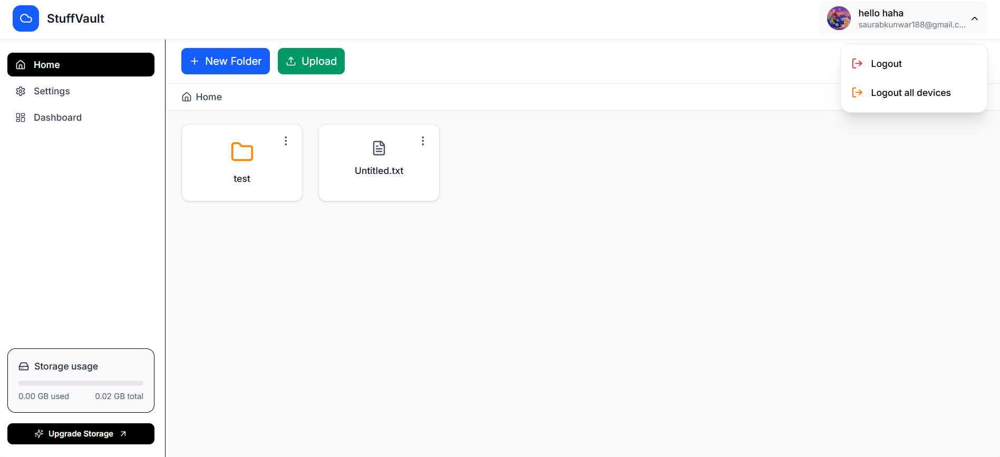
  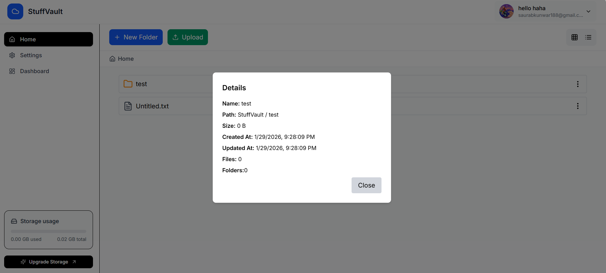
  
  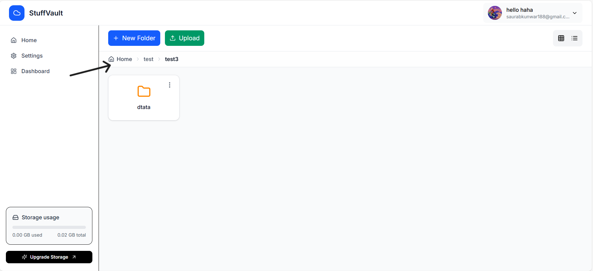
</p>

---

### Settings

<p align="center">
  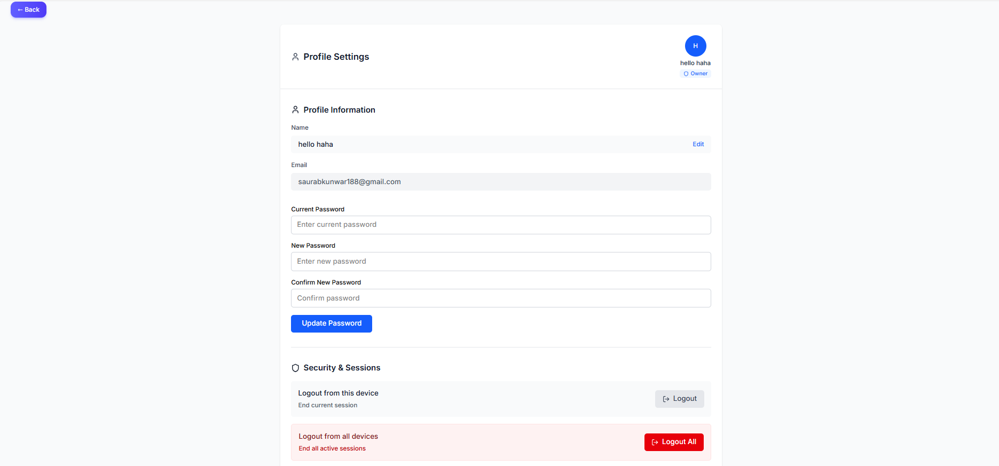
</p>

---

### Subscription

<p align="center">
  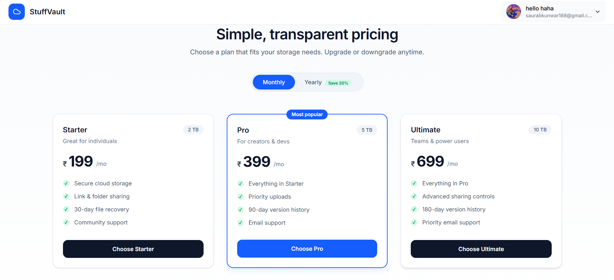
</p>

---

### Admin Dashboard

<p align="center">
  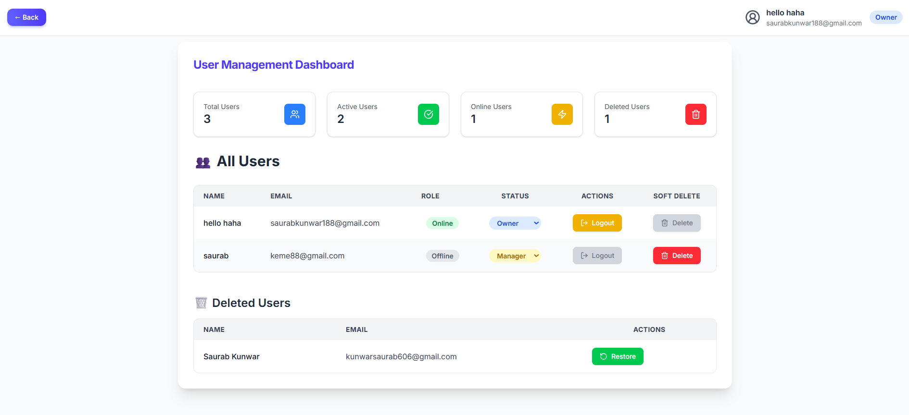
</p>

---

## Tech Stack

- **Frontend**: React, TailwindCSS, Vite
- **Backend**: Node.js, Express.js
- **Database**: MongoDB, Redis
- **Cloud Storage**: AWS S3, CloudFront CDN
- **External APIs**: Google OAuth2
- **Authentication**: Bcrypt + OTP + OAuth (Google/GitHub)

---
